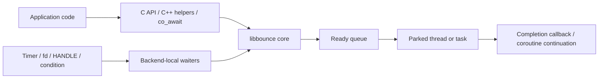

# libbounce

A small thread dispatch library that handles asynchronous I/O.


[](https://www.repostatus.org/#wip)
[](https://opensource.org/licenses/MIT)

---

[(Japanese language is here/日本語はこちら)](./README_ja.md)

> Please note that this English version of the document was machine-translated and then partially edited, so it may contain inaccuracies.
> We welcome pull requests to correct any errors in the text.

## What Is This?

Have you ever wanted to integrate a library that only offers basic support in C or C++ with fully asynchronous processing?

This applies to cases where only a basic API for asynchronous I/O is provided, and you want to implement coordination with other asynchronous I/O operations, or to provide a sophisticated and concise API using the `co_await` syntax in C++20.
Achieving this would dramatically simplify implementation at the application level, allowing developers to focus on more advanced features.
This is similar to how older JavaScript implementations relied on callback hell, but `Promise` and `await` made it possible to abstract asynchronous processing.

libbounce can assist in designing such asynchronous processing APIs and brings them into the C++20 ecosystem.

While "libuv" is a similar option, libbounce provides a much lighter-weight layer.
libbounce forms an extremely thin dispatch layer and also targets embedded software that is closely integrated with the hardware.

### For details

libbounce is a small dispatch library for continuing execution on threads or
tasks that are already waiting, when asynchronous I/O or timer waits complete.
Its core is implemented in C and supports Generic, POSIX, POSIX+GLib,
FreeRTOS, and Win32 backends.

For example, a backend can wait for a file descriptor or Win32 handle to become
ready. Once it is ready, it pushes a `completion` onto the ready queue, and the
thread or task parked in `bounce_park()` runs the continuation.

This gives you the following:

- You can separate the waiting operation itself from the context that runs the
  continuation.
- You can explicitly control which thread executes callbacks.
- You can use the same core from the C API, C++ helpers, and C++20 coroutines
  (`co_await`).
- You can fix capacities with compile-time macros so the library is easier to
  use in embedded systems.

libbounce is not a huge event-loop framework.
It is a small foundational component for safely bouncing asynchronous
completion notifications back to a chosen execution context.

## Installation

You can install it on your system using the [pre-built packages](https://github.com/kekyo/libbounce/releases),
or you can build it yourself.

The following types of pre-built packages are available:

- Debian trixie, bookworm: amd64, i686, arm64, armv7l (32-bit), riscv64, and their corresponding GLib versions
- Ubuntu 24.04, 22.04: amd64, arm64, and their corresponding GLib versions
- Windows: x64, x32

If you are building from source, first clone the repository and then build using the included Makefile for your target backend:

```bash
# Generic
make -f Makefile.generic all

# POSIX
make -f Makefile.posix all

# POSIX + GLib
make -f Makefile.posix_glib all

# FreeRTOS (tests on the POSIX port)
make -f Makefile.freertos test

# Win32 cross build
make -f Makefile.win32 all CC=x86_64-w64-mingw32-gcc-win32
```

If you want to run the full test set including the C / C++ layers, use:

```bash
# Full C / C++ test suite
sh build.sh

# Full C++20 coroutine test suite
sh build_cxx20.sh
```

For embedding, add the public headers under `include/libbounce/` and the
implementations under `src/` for the backend you use to your project.
The required source file combinations can be taken directly from each
`Makefile.*`.

Note that additional dependencies vary by backend.

- POSIX uses `pthread` and `poll()`.
- POSIX+GLib requires `glib-2.0`, `gobject-2.0`, and `gio-2.0`.
- FreeRTOS automatically fetches `FreeRTOS-Kernel` when you run
  `Makefile.freertos`.
- Running Win32 tests requires MinGW-w64 Win32-thread compilers and Wine.
- The Generic version uses only standard C11 features in the library itself. Host-side tests use `pthread`.
  For the Generic version, the compiler must support `_Thread_local` and GNU CAS intrinsics.

To build the entire libbounce project, follow these steps.
First, prepare the necessary packages:

```bash
$ sudo dpkg --add-architecture i386
$ echo "deb [trusted=yes] https://dl.espressif.com/dl/eim/apt/ stable main" | sudo tee /etc/apt/sources.list.d/espressif.list
$ sudo apt update
$ sudo apt install build-essential pkg-config libglib2.0-dev \
    nodejs \
    gcc-mingw-w64-x86-64-win32 g++-mingw-w64-x86-64-win32 \
    gcc-mingw-w64-i686-win32 g++-mingw-w64-i686-win32 \
    wine wine64 wine32:i386 podman
$ sudo apt install eim-cli
$ eim install
```

Once the environment is set up, all builds and tests are performed by the `build.sh` script.
This takes a long time:

```bash
$ ./build.sh
```

---

## API Usage

### Overall Structure

libbounce can roughly be divided into three layers.

- Core library:
  A general-purpose API written entirely in C (C99).
  It provides the shared foundation for all backends, including
  `bounce_post()`, `bounce_park()`, timers, and cancellation.
- Backend extensions:
  These handle wait targets specific to each OS or runtime, such as POSIX file
  descriptors, GLib `GSource`, FreeRTOS conditions, and Win32 `HANDLE`s.
- C++ helpers / C++20 coroutines:
  Thin wrappers that make the C API easier to use with RAII and `co_await`.
  All C++ support is written inline in headers.

Conceptually, it works like this.



What matters is that the thread that waits and the thread that runs the
continuation do not have to be the same.
The backend only enqueues the fact that something completed into the ready
queue, and the actual `completion` runs on the thread or task parked in
`bounce_park()`.

This parking model exists to stabilize the execution context of continuations.
If callbacks were run directly from an I/O wait thread or an ISR, reentrancy,
lock ordering, UI thread rules, and task-context restrictions would become
harder to manage.
In libbounce, the waiter only reports completion, and continuation execution is
centralized on the parked side.

If you specify `max_inline_depth`, and another continuation becomes ready
immediately while a continuation is already running, libbounce can execute it
inline up to the configured depth.
This reduces the overhead of nested `post()` calls and chained completions.

### Setting Up the Core

With the minimum setup, initialize `BOUNCE_CORE` and run `bounce_park()` on one
or more threads or tasks.
Then call `bounce_post()` or any of the await APIs from another context.

The following is the smallest example that runs a continuation with libbounce.
In this example, a new thread is created to act as the parker.

```c
#include <libbounce/bounce.h>

/* Completion continuation */
static void on_completed(BOUNCE_COMPLETION_RESULT result, void *state) {
  (void)state;
  if (result == BOUNCE_COMPLETION_COMPLETED) {
    /* ... */
  }
}

/* Entry point for the parker thread */
static void *parker_thread(void *state) {
  BOUNCE_CORE *bounce = (BOUNCE_CORE *)state;

  /* Make this thread visible to libbounce */
  bounce_set_core(bounce);

  /* Park the thread */
  (void)bounce_park(bounce, 0u);
  return NULL;
}

/* Main entry point */
int main(void) {
  /* Initialize libbounce */
  BOUNCE_CORE bounce;
  bounce_init(&bounce);

  /* ... create the parker thread here; platform-specific code ... */

  /* ------------------------------------- */

  /* ... start async work here; platform-specific code ... */

  /* Notify libbounce that the work completed */
  /* (the parker thread will run on_completed after this) */
  (void)bounce_post(&bounce, on_completed, NULL);

  /* ------------------------------------- */

  /* Start shutting down libbounce */
  bounce_shutdown(&bounce, false);

  /* ... wait for the parker thread to exit ... */

  /* Release BOUNCE_CORE */
  bounce_deinit(&bounce);
  return 0;
}
```

The basic lifecycle is as follows.

1. Initialize the core with `bounce_init()`.
2. Start `bounce_park()` on one or more threads or tasks.
3. Register `bounce_post()` or await APIs from other contexts.
4. Call `bounce_shutdown(..., false)` when stopping so parkers can exit.
5. Call `bounce_deinit()` only after confirming that all parkers have finished.

`bounce_park()` keeps waiting internally until a shutdown request arrives.
In other words, an application that uses libbounce explicitly owns one or more
threads responsible for running continuations.

In this example the parker is a newly created thread, but you can also park the
main thread itself.

For example, in GTK or Win32 applications it is common to run the GUI thread on
the main thread in a message-pump-driven model.
In that case, you call `bounce_park()` directly on the main thread.

### Chaining Continuations

`bounce_set_core()` publishes a `BOUNCE_CORE` to TLS so the current thread or
task can retrieve it via `bounce_get_core()`.
If TLS does not hold a core, `bounce_get_core()` falls back to the process-wide
pointer configured by `bounce_set_fallback_core()`.

The important point is that calling `bounce_park()` does not set it
automatically.
So, in a thread or task responsible for parking, if you want to:

- retrieve the current core from inside a continuation
- or call `bounce_post()` or a wait API again from a helper that is not passed
  the core explicitly

you need to call `bounce_set_core()` in advance.

This matters in particular when you want to register the next async operation in
the middle of a callback chain, or when C++ code wants to use the current core
to resolve `libbounce::bounce::get_current()` or coroutine resumption targets.
Conversely, it is not required if you always pass `BOUNCE_CORE*` explicitly.
The C++ `park()` and `park_once()` wrappers publish the current core
automatically while they are running, but the C API still requires explicit
`bounce_set_core()` when you want `bounce_get_core()` to work on a parker.

The following example uses `bounce_get_core()` inside a continuation to chain
the next continuation.

```c
/* Second-stage continuation */
static void on_second(BOUNCE_COMPLETION_RESULT result, void *state) {
  (void)result;
  (void)state;
  /* Run the next step here */
}

/* First-stage continuation */
static void on_first(BOUNCE_COMPLETION_RESULT result, void *state) {
  (void)state;

  /* Do not register the next continuation unless this completed normally */
  if (result != BOUNCE_COMPLETION_COMPLETED) {
    return;
  }

  /* Read the core associated with the current thread, or the fallback core */
  BOUNCE_CORE *current = bounce_get_core();
  if (current != NULL) {
    /* Register the next continuation on the same core */
    (void)bounce_post(current, on_second, NULL);
  }
}

/* Entry point for the parker thread */
static void *parker_thread(void *state) {
  BOUNCE_CORE *bounce = (BOUNCE_CORE *)state;

  /* Make bounce_get_core() work on this thread */
  bounce_set_core(bounce);

  /* Wait as a parker that runs continuations */
  (void)bounce_park(bounce, 0u);

  /* Clear the TLS exposure before leaving the thread */
  /* (not required if the thread is about to exit anyway) */
  bounce_set_core(NULL);
  return NULL;
}
```

### Cancellation

If you want to stop an individual wait request before it completes, use
`BOUNCE_CANCELLATION` instead of `bounce_shutdown()`.
`bounce_shutdown()` requests that all parkers stop and is the operation for
winding down the entire library.
Pass `wait_for_idle=true` when you want parked threads or tasks to keep
draining already-pending wait operations before they leave.
Cancellation is for cases where you want to withdraw only one wait.

Use it as follows.

1. Initialize a cancellation source with `bounce_cancellation_init()`.
2. Pass that cancellation source to `bounce_await_timeout()` or a backend await
   API when registering the wait.
3. Call `bounce_cancel()` from another thread, task, or continuation.
4. Registered continuations are resolved with
   `BOUNCE_COMPLETION_CANCELED`.

If multiple waits share the same `BOUNCE_CANCELLATION`, you can cancel them as
a group.
However, cancellation is one-shot, and a source cannot be reused after
`bounce_cancel()` has been called once.
Also, if a wait has already completed normally, canceling it afterward does not
override the normal completion.

The following is the smallest example that registers a timer wait and later
cancels it.

```c
/* Application state that receives the completion result */
typedef struct APP_STATE {
  bool done;
} APP_STATE;

/* Completion continuation for the timer wait */
static void on_timeout(BOUNCE_COMPLETION_RESULT result, void *state) {
  APP_STATE *app = (APP_STATE *)state;

  /* Branch by completion reason */
  switch (result) {
    case BOUNCE_COMPLETION_COMPLETED:
      /* The timer waited successfully until the timeout */
      break;
    case BOUNCE_COMPLETION_CANCELED:
      /* It was canceled from another context */
      break;
    case BOUNCE_COMPLETION_ABORTED:
    default:
      /* The wait could not complete because of shutdown or backend failure */
      break;
  }

  /* Notify the caller that completion was observed */
  app->done = true;
}

/* Register a timer wait and cancel it later */
static void start_and_cancel(BOUNCE_CORE *bounce) {
  /* Prepare objects needed for the wait */
  BOUNCE_TIMER timer;
  BOUNCE_CANCELLATION cancellation;
  APP_STATE app = { false };

  /* Initialize the timer and cancellation source */
  bounce_timer_init(&timer);
  bounce_cancellation_init(&cancellation);

  /* Register a cancelable timer wait */
  (void)bounce_await_timeout(
    bounce,
    &timer,
    5000u,
    on_timeout,
    &app,
    &cancellation);

  /* ... another thread, task, or continuation decides to stop waiting ... */

  /* Issue cancellation and resolve the continuation as CANCELED */
  bounce_cancel(bounce, &cancellation);

  /* ... the caller waits until app.done becomes true ... */

  /* Release related objects after the wait completes */
  bounce_cancellation_deinit(&cancellation);
  bounce_timer_deinit(&timer);
}
```

If you only want to react to the cancellation notification itself, you can
register a dedicated continuation with `bounce_register_canceled()` /
`bounce_unregister_canceled()`.

### Introducing C++ (`co_await`)

All libbounce functionality can be driven through the C API, but it is fairly
verbose.

Library authors can expose APIs that support the async features added in C++20
(coroutines, `co_await`), allowing library users to write async code more
safely and with less boilerplate.

It is possible to implement C++20 async APIs on top of libbounce using only the
C API, but that requires a fair amount of code.
The C++ helpers and C++20 coroutine API dramatically reduce that amount.

libbounce provides `libbounce::promise<T>` and `await_operation` for C++20
coroutines in `include/libbounce/promise.h`.
If you want to make an existing callback-based async API `co_await`-compatible,
the basic approach is to use `libbounce::make_awaitable()`.

All you need is a function that registers the async operation at start time and
calls `BOUNCE_COMPLETION` exactly once when it completes.

The following example implements a network operation with the libbounce C++20
API.

```cpp
#include <libbounce/bounce.h>
#include <libbounce/promise.h>

// A type that encapsulates network access
struct my_socket {
  // A C-like API exists that reports completion through a callback
  bool async_read_some(
    BOUNCE_COMPLETION completion,
    void *completion_state,
    BOUNCE_CANCELLATION *cancellation) noexcept;
};

// Convert the C API above into an awaitable object that supports co_await
static auto read_some_awaitable(
  libbounce::bounce &bounce,
  my_socket &socket,
  BOUNCE_CANCELLATION *cancellation) noexcept {
  return libbounce::make_awaitable(
    bounce,
    // Lambda that starts the async operation by calling my_socket.async_read_some()
    [&socket](
      BOUNCE_COMPLETION completion,
      void *completion_state,
      BOUNCE_CANCELLATION *operation_cancellation) noexcept -> bool {
      return socket.async_read_some(
        completion,
        completion_state,
        operation_cancellation);
    },
    cancellation);
}

//    :
//    :

// Example of user code written in C++20
static libbounce::promise<void> session(
  libbounce::bounce &bounce,
  my_socket &socket) {

  // Wait for the C++20 async API with co_await
  const libbounce::await_result result =
    co_await read_some_awaitable(bounce, socket, nullptr);
  // Exit if the operation did not complete successfully
  if (!result.completed()) {
    co_return;
  }

  //
}
```

The start function passed to `make_awaitable()` must obey the following
contract.

- Return `false` if local setup fails.
  In that case, the await result becomes `start_failed()`.
- Return `true` if registration succeeded, and call
  `completion(result, completion_state)` exactly once on completion.
- If you want cancellation support, pass the provided
  `BOUNCE_CANCELLATION*` down to the lower layer.

If you only want to hop the current coroutine onto the parker, use
`libbounce::resume_on()`.
If you want to wait for cancellation notification itself, use
`libbounce::await_canceled()`.

### C++ Helpers

`include/libbounce/bounce.h` includes thin C++ helpers that wrap the C API with
RAII.
They are useful whenever you want clear ownership and lifetime management.

The main types are as follows.

- `libbounce::bounce`:
  The owning class for `BOUNCE_CORE`.
  It exposes `post()`, `park()`, `park_once()`, and `shutdown()`.
- `libbounce::timer`:
  An RAII wrapper for `BOUNCE_TIMER`.
  Register timer waits with `timer.wait(...)`.
- `libbounce::cancellation`:
  A cancellation source.
  Call `cancel(bounce)` to issue cancellation.
- `libbounce::cancellation_registration`:
  Registers a continuation that runs on cancellation.
- `libbounce::bounce_ref`:
  A non-owning reference to `bounce`, useful when dealing with a core already
  attached to the current thread.

On POSIX and FreeRTOS, `libbounce::condition` is also available.

The simplest usage is to pass a lambda instead of a C function pointer.

```cpp
#include <libbounce/bounce.h>
#include <thread>

/* Own the bounce core */
libbounce::bounce bounce;
/* Own an object for timer waits */
libbounce::timer timer;

/* Start a thread for the parker */
std::thread parker([&bounce] {
  /* Wait as a parker that runs continuations */
  (void)bounce.park();
});

/* Register a timer continuation that runs after 100 ms */
(void)timer.wait(
  bounce,
  100u,
  /* You can pass a lambda instead of a C function pointer */
  [](BOUNCE_COMPLETION_RESULT result) {
    /* Run timeout handling only on normal completion */
    if (result == BOUNCE_COMPLETION_COMPLETED) {
      /* This lambda runs on the parker thread */
    }
  },
  /* No cancellation in this example */
  nullptr);

/* Request the parker to stop */
bounce.shutdown();
/* Wait for the parker thread to exit */
parker.join();
```

Also, while the C++ `park()` and `park_once()` wrappers are running, they
publish the current bounce so `libbounce::bounce::get_current()` resolves to a
non-owning `bounce_base_ref`.

```cpp
/* Own the bounce core */
libbounce::bounce bounce;
/* Queue a continuation that will run on the parker */
(void)bounce.post([] {
  /* Read the current bounce reference while parked */
  auto current = libbounce::bounce::get_current();

  /* If the current bounce is available, register another continuation through it */
  if (current) {
    (void)current.post([] {
      /* Continuation body through bounce_base_ref obtained from get_current() */
    });
  }
});
/* The C++ wrapper publishes the current core while dispatching continuations */
(void)bounce.park_once();
```

This is useful inside library internals or callback chains when you do not want
to pass the reference explicitly but still want to obtain the current bounce.

---

### C API

#### Common bounce API

The common API provides the basic operations that mean the same thing on every
backend.

|API|Role|
|:----|:----|
|`bounce_init()` / `bounce_deinit()`|Initialize and destroy the core|
|`bounce_post()`|Push a continuation onto the ready queue so it runs on a parker|
|`bounce_park()`|Park the current thread or task as a parker|
|`bounce_park_once()`|Run only the continuations that are dispatchable right now, once, then return|
|`bounce_shutdown()`|Request all parkers to stop, optionally after pending waits settle|
|`bounce_set_core()` / `bounce_get_core()` / `bounce_set_fallback_core()`|Publish and read the core for the current thread or task, with an optional process-wide fallback|
|`bounce_cancellation_*()`|Initialize, issue, and destroy a cancellation source|
|`bounce_register_canceled()` / `bounce_unregister_canceled()`|Register and unregister a continuation that runs on cancellation|
|`bounce_timer_*()` / `bounce_await_timeout()`|Initialize a timer, register a wait, and destroy it|

`BOUNCE_COMPLETION_RESULT` represents why a continuation completed.

- `BOUNCE_COMPLETION_COMPLETED`:
  Normal completion.
- `BOUNCE_COMPLETION_CANCELED`:
  The continuation completed because of cancellation.
- `BOUNCE_COMPLETION_ABORTED`:
  The continuation could not complete because of shutdown, destruction, backend
  failure, or a similar reason.

`bounce_park_once()` is useful when integrating into a host that already has
its own event loop or main loop.

```c
/* Prepare the bounce core */
BOUNCE_CORE bounce;
/* Prepare an object for timer waits */
BOUNCE_TIMER timer;

/* Initialize the core and timer */
bounce_init(&bounce);
bounce_timer_init(&timer);

/* Register a timer that calls on_completed() after 100 ms */
(void)bounce_await_timeout(&bounce, &timer, 100u, on_completed, NULL, NULL);

/* In a custom loop, run only continuations that are dispatchable right now */
while (!done) {
  /* Run a ready continuation on the current thread if one exists */
  (void)bounce_park_once(&bounce, 0u);
  /* Keep doing host-side polling or frame updates */
}

/* Destroy wait objects first */
bounce_timer_deinit(&timer);
/* Destroy the core last */
bounce_deinit(&bounce);
```

One thing to note is that if `bounce_deinit()` runs while pending continuations
or registrations still remain, they may be resolved as
`BOUNCE_COMPLETION_ABORTED`.
In practice, it is safest to confirm that parkers have stopped and that
registered objects are no longer live before destroying the core.

#### Platform-specific bounce API

Each backend adds its own wait targets and helper types.

|Platform|Header|Additional API|Purpose|
|:----|:----|:----|:----|
|Generic|`libbounce/generic.h`|None|Single-parker generic core with busy-spin parking and timer polling, without backend-specific wait targets|
|POSIX|`libbounce/posix.h`|`bounce_await_posix_condition()`, `bounce_posix_condition_raise()`, `bounce_await_posix_fd()`|Wait for fd readiness based on `poll()`. A lightweight one-shot condition is also available|
|POSIX+GLib|`libbounce/posix_glib.h`|`bounce_await_posix_glib_fd()`|Wait for fd readiness integrated with `GMainContext` / `GSource`|
|FreeRTOS|`libbounce/freertos.h`|`bounce_await_freertos_condition()`, `bounce_freertos_condition_raise()`, `bounce_freertos_condition_raise_from_isr()`|Notify a condition from both task context and ISR context|
|FreeRTOS + ESP-IDF option|`libbounce/freertos.h`|`bounce_await_freertos_fd()`|Wait for fd readiness only when `BOUNCE_FREERTOS_ENABLE_FD_AWAIT` is enabled|
|Win32|`libbounce/win32.h`|`bounce_await_win32_handle()`|Wait on `HANDLE`s such as events and waitable timers|

The intended usage for each backend is as follows.

- Generic:
  Intended for environments where you want to avoid backend-specific wait APIs
  entirely and can dedicate one thread to busy spinning inside `bounce_park()`.
  It provides `post()` and timer polling, but no backend-local `wait(...)`
  targets.
- POSIX:
  Suitable when you want to run `bounce_park()` on a dedicated thread while
  waiting for fd readability or writability.
  fd waiting uses `poll(2)` events such as `POLLIN` and `POLLOUT`.
- POSIX+GLib:
  Intended for applications that already use the GLib main loop.
  The ready queue is processed as a source on `GMainContext`, so it integrates
  naturally with the GLib model.
- FreeRTOS:
  Suitable when running a task as a parker and handling lightweight condition
  notifications or timers.
  Because `raise_from_isr()` exists, continuations can be scheduled safely from
  ISRs.
- Win32:
  Fits naturally into the `HANDLE`-based waiting model.
  It works especially well with event objects and waitable timers.

The C++ helpers add backend-local `bounce.wait(...)`, `bounce.raise(...)`, and
`bounce.await(...)` where they exist.
In other words, the central idea is the same on every backend: once something
becomes ready, run the continuation on a parker.
What changes is what can be waited on and which OS mechanism performs the wait.

### C++ Helper API

Use the C++ helpers from each backend's public header.
The shared thin RAII wrappers use the same names on every backend, and only
backend-specific wait targets are added where needed.

The common types are as follows.

|Type / Method|Role|
|:----|:----|
|`libbounce::bounce`|Owning class for `BOUNCE_CORE`. Exposes `post()`, `park()`, `park_once()`, and `shutdown()`|
|`libbounce::bounce::get_current()`|Returns the core currently attached to the thread or task, or the configured fallback core, as `bounce_base_ref`|
|`libbounce::bounce_base_ref`|Common non-owning reference. Lets you call `get_core()`, `post()`, `park()`, `park_once()`, `shutdown()`, and similar operations on a core managed elsewhere|
|`libbounce::bounce_ref`|Backend-specific non-owning reference. Extends `bounce_base_ref` with backend-local helper methods where available|
|`libbounce::timer`|RAII wrapper for `BOUNCE_TIMER`. Registers timer waits with `wait(bounce, duration_msec, ...)`|
|`libbounce::cancellation`|RAII wrapper for `BOUNCE_CANCELLATION`. Issues cancellation with `cancel(bounce)`|
|`libbounce::cancellation_registration`|RAII wrapper for cancellation continuations. Exposes `register_canceled(...)` and `unregister()`|

The backend-specific differences are mostly in the arguments of `wait(...)`,
`raise(...)`, and `await(...)`.

|Backend|Main additional types / methods|
|:----|:----|
|Generic|No additional backend-local wait methods. Use `post()` and `libbounce::timer`|
|POSIX|`libbounce::condition`, `bounce.wait(condition, ...)`, `bounce.raise(condition)`, `bounce.wait(fd, poll_events, ...)`|
|POSIX+GLib|`bounce.wait(fd, GIOCondition, ...)`|
|FreeRTOS|`libbounce::condition`, `bounce.wait(condition, ...)`, `bounce.raise(condition)`, `bounce.raise_from_isr(condition)`|
|FreeRTOS + ESP-IDF option|`bounce.wait(fd, BOUNCE_FREERTOS_FD_EVENT_*, ...)`|
|Win32|`bounce.wait(HANDLE, ...)`|

`post()` and the callable forms of `wait()` accept either a no-argument lambda
or a lambda that takes `BOUNCE_COMPLETION_RESULT` as its single argument.
The return value `bool` mainly indicates whether local allocation or upfront
setup succeeded.
Failures after backend registration are reported asynchronously as
`BOUNCE_COMPLETION_ABORTED`.

### C++20 API

`include/libbounce/promise.h` is available in C++20 or later.
It defines the minimal set needed to bridge callback-based libbounce APIs into
`co_await`.

The central types and functions are as follows.

|Type / Function|Role|
|:----|:----|
|`libbounce::await_status`|Enumeration that represents `completed`, `canceled`, `aborted`, and `start_failed`|
|`libbounce::await_result`|Wrapper around `await_status`. You can check it with `completed()`, `canceled()`, `aborted()`, and `start_failed()`|
|`libbounce::await_operation`|Awaitable object that makes callback-based registrations `co_await`-able|
|`libbounce::promise<T>`|Return type for libbounce coroutines. Start it with `start()`, or `co_await` it from another coroutine|
|`libbounce::make_awaitable(...)`|Creates an `await_operation` from a start function that takes `(BOUNCE_COMPLETION, void*, BOUNCE_CANCELLATION*)`|
|`libbounce::resume_on(bounce)`|Hops the current coroutine onto a parker through `bounce_post()`|
|`libbounce::await_canceled(bounce, cancellation)`|`co_await`s the cancellation notification itself|
|`bounce.await(...)` / `bounce_ref.await(...)`|Registers backend wait targets directly in a form that can be `co_await`ed|

The start function passed to `make_awaitable()` must return `false` on local
setup failure, and once the start succeeds, it must call
`completion(result, completion_state)` exactly once when the operation
finishes.
If you follow this contract, you can bridge existing callback-based async APIs
into `co_await` without a large rewrite.

Also, `libbounce::promise<T>` uses lazy start rather than eager start.
A created coroutine does not begin running until you call `start()`, and
destroying a started but unfinished promise is a programming error.

---

## Platform Notes

### POSIX+GLib

When you use libbounce together with GTK or another framework that already
drives a GLib main loop, initialize the POSIX+GLib backend with that existing
`GMainContext` and then call `bounce_park()` instead of starting a separate
`gtk_main()` loop.

Use `bounce_init_with_main_context(&bounce, g_main_context_default())` for the
C API, or `libbounce::bounce bounce(g_main_context_default())` for the C++
helper.
Passing `NULL` still keeps the old behavior and creates a private
`GMainContext`.

The important point is that `bounce_park()` becomes the single blocking loop on
the GUI thread.
If you call `gtk_main()` separately, GTK and libbounce end up driving different
dispatch loops.

The following simplified GTK3 `main()` shows the intended shape:

```cpp
#include <gtk/gtk.h>
#include <libbounce/posix_glib.h>

static void on_destroy(GtkWidget *widget, gpointer user_data) {
  auto *bounce = static_cast<libbounce::bounce *>(user_data);

  (void)widget;
  bounce->shutdown();
}

int main(int argc, char **argv) {
  gtk_init(&argc, &argv);

  libbounce::bounce bounce(g_main_context_default());
  GtkWidget *window = gtk_window_new(GTK_WINDOW_TOPLEVEL);

  gtk_window_set_title(GTK_WINDOW(window), "example");
  g_signal_connect(window, "destroy", G_CALLBACK(on_destroy), &bounce);
  gtk_widget_show_all(window);

  (void)bounce.park();
  return 0;
}
```

The equivalent C initialization is:

```c
gtk_init(&argc, &argv);
BOUNCE_CORE bounce;
bounce_init_with_main_context(&bounce, g_main_context_default());
```

If callbacks or helpers need `bounce_get_core()` in the C API, call
`bounce_set_core()` before entering `bounce_park()`. The C++ `bounce.park()`
and `bounce.park_once()` wrappers publish the current core automatically while
they are running.

---

## Packaging

`libbounce` also provides a packaging script modeled after the `libdispatcher` workflow.

Install the versioning tool first.
For more information on [screw-up-native](https://github.com/kekyo/screw-up-native), please refer to the repository.

```bash
wget https://github.com/kekyo/screw-up-native/releases/download/0.1.0/screw-up-native-ubuntu-noble-amd64-0.1.0.deb
sudo apt install ./screw-up-native-ubuntu-noble-amd64-0.1.0.deb
```

Install the packaging prerequisites:

```bash
sudo apt install podman qemu-user-static zip \
  gcc-mingw-w64-x86-64-win32 gcc-mingw-w64-i686-win32
```

Generate all supported package artifacts.
This takes a VERY long time:

```bash
sh build_pack.sh
```

Independent package targets are built in parallel by default. Use `--jobs <count>` to cap concurrent package builds when needed.

This generates:

- Debian packages for `libbounce` and `libbounce-glib`
- Win32 zip packages for `x86` and `x64`

Artifacts are written under `artifacts/`.

If you want the full test run including packaging verification, use:

```bash
sh test.sh
```

---

## License

Under MIT.
