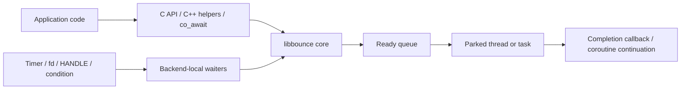

# libbounce

A small thread dispatch library that handling asynchronous I/O.


[](https://www.repostatus.org/#wip)
[](https://opensource.org/licenses/MIT)

---

[(English language is here.)](./README.md)

## これは何?

CやC++で単純なサポートしか存在しないライブラリを、完全非同期処理と統合したいと考えたことはありますか？

非同期I/O処理を行う基礎的なAPIしか提供されず、これを他の非同期I/O処理と協調処理させるような実装や、C++20における`co_await`構文による高度で簡潔なAPIを提供したい場合です。
これらが実現すれば、アプリケーションレベルの実装を飛躍的に簡略化でき、より高度な実装に取り組むことができるようになります。
これは丁度、昔のJavaScript実装が、コールバック地獄によって成り立っていたのが、`Promise`と`await`によって、非同期処理を抽象化出来た事に近いです。

libbounceは、そのような非同期処理API設計を補助することができて、更にC++20の世界に持ち込むことが出来ます。

同じような選択肢として "libuv" が挙げられますが、 libbounce はもっと基底の薄い層です。
libbounce は、限りなく薄いディスパッチ層を形成し、ハードウェアと密接に絡む組み込みソフトウェアもターゲットに入れています。

### 細部について

libbounceは、非同期I/Oやタイマー待機の「完了」を、あらかじめ待機しているスレッドやタスク上で継続実行するための、小さなディスパッチライブラリです。
コアはCで実装されていて、Generic / POSIX / POSIX+GLib / FreeRTOS / Win32 の各バックエンドに対応します。

例えば、ファイルディスクリプタやWin32ハンドルの準備完了をバックエンドで待ち受け、
準備が整ったら `completion` を ready queue に積み、
最後に `bounce_park()` しているスレッドやタスクがその継続処理を実行します。

これによって、

- 待機処理そのものと、継続処理を実行する文脈を分離できます。
- コールバックを「どのスレッドで実行するか」を明示的に制御できます。
- C APIだけでなく、C++ヘルパーやC++20 coroutine (`co_await`) からも同じコアを利用できます。
- 容量をコンパイル時マクロで固定し、組み込み向けにも扱いやすい構成にできます。

libbounceは巨大なイベントループフレームワークではありません。
むしろ、「非同期の完了通知を、指定した実行文脈へ安全に跳ね返す」ための小さな基盤部品です。

## インストール

[プリビルド済みパッケージ](https://github.com/kekyo/libbounce/releases) を使用して、あなたの環境にインストールするか、
あるいは自力でビルドする必要があります。

プリビルド済にパッケージには、以下の種類があります:

- Debian trixie, bookworm: amd64, i686, arm64, armv7l (32bit), riscv64, 及びそのGLibバージョン
- Ubuntu 24.04, 22.04: amd64, arm64, 及びそのGLibバージョン
- Windows: x64, x32

自力でビルドする場合は、まずはリポジトリをcloneし、対象バックエンドに応じて付属のMakefileでビルドします:

```bash
# Generic
make -f Makefile.generic all

# POSIX
make -f Makefile.posix all

# POSIX + GLib
make -f Makefile.posix_glib all

# FreeRTOS (POSIX port上でテスト)
make -f Makefile.freertos test

# Win32 cross build
make -f Makefile.win32 all CC=x86_64-w64-mingw32-gcc-win32
```

テストを含めて一通り確認したい場合は、以下のスクリプトが使えます。

```bash
# C / C++ テスト一式
./build.sh

# C++20 coroutine テスト一式
./build_cxx20.sh
```

ソースコードを組み込む時は、`include/libbounce/` 以下の公開ヘッダと、利用するバックエンドに対応する `src/` 配下の実装をプロジェクトへ追加してください。
必要なソースファイルの組み合わせは、各 `Makefile.*` がそのまま参考になります。

なお、追加の依存関係はバックエンドごとに異なります。

- POSIX は `pthread` と `poll()` を使用します。
- POSIX+GLib は `glib-2.0`, `gobject-2.0`, `gio-2.0` が必要です。
- FreeRTOS は `Makefile.freertos` 実行時に `FreeRTOS-Kernel` を自動取得します。
- Win32 テスト実行には MinGW-w64 の Win32-thread compiler と Wine が必要です。
- Generic はライブラリ本体では標準C11機能のみを使用します。ホスト側テストでは `pthread` を使います。
  Generic ではコンパイラが `_Thread_local` とgnu cas intrinsicを扱える必要があります。

libbounce全体の開発ビルドは、以下の手順で行います。まず、必要なパッケージを準備します:

```bash
$ sudo dpkg --add-architecture i386
$ echo "deb [trusted=yes] https://dl.espressif.com/dl/eim/apt/ stable main" | sudo tee /etc/apt/sources.list.d/espressif.list
$ sudo apt update
$ sudo apt install build-essential pkg-config libglib2.0-dev \
    nodejs \
    gcc-mingw-w64-x86-64-win32 g++-mingw-w64-x86-64-win32 \
    gcc-mingw-w64-i686-win32 g++-mingw-w64-i686-win32 \
    wine wine64 wine32:i386 podman
$ sudo apt install eim-cli
$ eim install
```

環境が構築できれば、 `build.sh` スクリプトですべてのビルドとテストが行われます。
これには長い時間がかかります:

```bash
$ ./build.sh
```

---

## API使用方法

### 全体的な構造

libbounceは、大きく分けると3層に分かれています。

- Coreライブラリ:
  完全にC言語 (C99) でのみ書かれた、汎用性を考慮したAPIで、
  `bounce_post()`, `bounce_park()`, タイマー、キャンセルなど、全バックエンド共通の土台です。
- バックエンド拡張:
  POSIXのfd待機、GLibの `GSource`、FreeRTOSのcondition、Win32の `HANDLE` など、
  OSやランタイムごとの待機対象を扱います。
- C++ヘルパー / C++20 coroutine:
  C APIをRAIIと `co_await` で扱いやすくする薄いラッパーです。
  C++に対応したコードはヘッダファイルにすべてインラインで記述されています。

概念的には、次のように動作します。



重要なのは、待機を行うスレッドと、継続処理を実行するスレッドが必ずしも同じではないことです。
バックエンド側は「完了した」という事実を ready queue に積むだけで、
実際の `completion` 実行は `bounce_park()` しているスレッドやタスクが担当します。

この「パーキング」が必要なのは、継続処理の実行文脈を安定させるためです。
例えば、I/O待機専用スレッドやISRから直接コールバックを実行してしまうと、
再入やロック順序、UIスレッド規約、タスク文脈制約の扱いが難しくなります。
libbounceでは、待機側は通知だけを行い、継続処理はパーキング側へ集約します。

また、`max_inline_depth` を指定すると、継続処理の中でさらに新しい継続が即時に ready になった場合に、
一定の深さまでその場でインライン実行できます。
これはネストした `post()` や完了連鎖のオーバーヘッドを抑えるための仕組みです。

### Coreの準備

最小構成では、`BOUNCE_CORE` を初期化し、1本以上のスレッドまたはタスクで `bounce_park()` を実行します。
その後、別の文脈から `bounce_post()` や各種 await API を呼び出します。

以下は、libbounceを使用して、継続処理を実行させる最小限のコード例です。
この例では、パーキングさせるスレッドを新たに生成しています。

```c
#include <libbounce/bounce.h>

/* 完了継続処理 */
static void on_completed(BOUNCE_COMPLETION_RESULT result, void *state) {
  (void)state;
  if (result == BOUNCE_COMPLETION_COMPLETED) {
    /* r */
  }
}

/* パーキングスレッドのエントリポイント */
static void *parker_thread(void *state) {
  BOUNCE_CORE *bounce = (BOUNCE_CORE *)state;

  /* スレッドをlibbound管理下に置く */
  bounce_set_core(bounce);

  /* スレッドをパーキングさせる */
  (void)bounce_park(bounce, 0u);
  return NULL;
}

/* メインエントリポイント */
int main(void) {
  /* libboundを初期化する */
  BOUNCE_CORE bounce;
  bounce_init(&bounce);

  /* ... (ここでパーキングスレッドを生成・プラットフォーム依存のコード) */

  /* ------------------------------------- */

  /* ... (非同期処理の開始・プラットフォーム依存のコード) */

  /* 完了した時に、libbounceに完了を通知する */
  /* (この後、パーキングスレッドがon_completedを実行する) */
  (void)bounce_post(&bounce, on_completed, NULL);

  /* ------------------------------------- */

  /* libboundのシャットダウンを開始する */
  bounce_shutdown(&bounce);

  /* ... (パーキングスレッドが終了するのを待機) */

  /* BOUNCE_COREを解放する */
  bounce_deinit(&bounce);
  return 0;
}
```

基本的なライフサイクルは次の通りです。

1. `bounce_init()` でコアを初期化する。
2. 1本以上のスレッドまたはタスクで `bounce_park()` を開始する。
3. 他の文脈から `bounce_post()` や await API を登録する。
4. 停止時に `bounce_shutdown()` を呼び、パーキングを解除する。
5. すべての parker の終了を確認してから `bounce_deinit()` する。

`bounce_park()` は停止要求が来るまで内部で待機し続けます。
つまり、libbounceを使うアプリケーションでは「継続を実行する担当スレッド」を明示的に持つことになります。

この例では、パーキングスレッドを新たに生成したスレッドとしていますが、
もちろん、メインスレッドをパーキングさせることも出来ます。

例えば、GTKやWin32の場合は、GUIのスレッドをメインスレッドで実行することが一般的であり（メッセージポンプ駆動）、
その場合は、メインスレッドでそのまま `bounce_park()` を呼び出すことになります。

### 継続の連鎖を実現させる

`bounce_set_core()` は、現在のスレッドまたはタスクから
`bounce_get_core()` で参照できる `BOUNCE_CORE` を TLS へ公開するためのAPIです。
TLS に core が登録されていない場合、`bounce_get_core()` は
`bounce_set_fallback_core()` で設定したプロセス共通のフォールバック core を返します。

重要なのは、`bounce_park()` を呼んでも自動ではセットされないことです。
そのため、パーキング担当のスレッドやタスクの中で
「継続の内部から現在の core を取り出したい」
「明示的に引数で渡していない helper から再度 `bounce_post()` や wait API を呼びたい」
といった用途がある場合は、あらかじめ `bounce_set_core()` を呼んでおく必要があります。

これは特に、コールバックチェインの途中で次の非同期処理を登録したい場合や、
C++ 側で `libbounce::bounce::current()` や coroutine 継続復帰先の解決に
現在の core を使いたい場合に意味があります。
逆に、常に `BOUNCE_CORE*` を明示的に受け渡す設計なら必須ではありません。

以下は、継続の中で `bounce_get_core()` を使って次の継続を連鎖させる例です。

```c
/* 2段目の継続処理 */
static void on_second(BOUNCE_COMPLETION_RESULT result, void *state) {
  (void)result;
  (void)state;
  /* ここで次の処理を行う */
}

/* 1段目の継続処理 */
static void on_first(BOUNCE_COMPLETION_RESULT result, void *state) {
  (void)state;

  /* 正常完了以外では次の継続を登録しない */
  if (result != BOUNCE_COMPLETION_COMPLETED) {
    return;
  }

  /* 現在のスレッドに紐付いた core、またはフォールバック core を取得する */
  BOUNCE_CORE *current = bounce_get_core();
  if (current != NULL) {
    /* 同じ core に対して次の継続を登録する */
    (void)bounce_post(current, on_second, NULL);
  }
}

/* パーキングスレッドのエントリポイント */
static void *parker_thread(void *state) {
  BOUNCE_CORE *bounce = (BOUNCE_CORE *)state;

  /* このスレッドから bounce_get_core() で参照できるようにする */
  bounce_set_core(bounce);

  /* 継続を実行する parker として待機する */
  (void)bounce_park(bounce, 0u);

  /* スレッドを抜ける前にTLSの公開を解除する */
  /* (これでスレッドが終了するなら不要) */
  bounce_set_core(NULL);
  return NULL;
}
```

### 中断処理

個々の待機要求を途中で止めたい場合は、`bounce_shutdown()` ではなく
`BOUNCE_CANCELLATION` を使います。
`bounce_shutdown()` は parker 全体の停止要求であり、ライブラリ全体を畳む時の操作です。
一方、キャンセルは「この待機だけを取り下げたい」という用途に使います。

使い方は次の通りです。

1. `bounce_cancellation_init()` でキャンセルソースを初期化する。
2. `bounce_await_timeout()` や各バックエンドの await API に、そのキャンセルソースを渡して登録する。
3. 別スレッド・別タスク・別継続から `bounce_cancel()` を呼ぶ。
4. 登録済み継続は `BOUNCE_COMPLETION_CANCELED` で解決される。

同じ `BOUNCE_CANCELLATION` を複数の待機に共有すれば、まとめて中断できます。
ただしキャンセルは one-shot で、一度 `bounce_cancel()` されたソースは再利用できません。
また、既に通常完了した待機に対して後からキャンセルしても、通常完了が優先されます。

以下は、タイマー待機を後から中断する最小例です。

```c
/* 完了状態を受け取るアプリケーション側の状態 */
typedef struct APP_STATE {
  bool done;
} APP_STATE;

/* タイマー待機の完了継続処理 */
static void on_timeout(BOUNCE_COMPLETION_RESULT result, void *state) {
  APP_STATE *app = (APP_STATE *)state;

  /* 完了理由ごとに分岐する */
  switch (result) {
    case BOUNCE_COMPLETION_COMPLETED:
      /* タイムアウト時間まで正常に待機できた */
      break;
    case BOUNCE_COMPLETION_CANCELED:
      /* 別の文脈からキャンセルされた */
      break;
    case BOUNCE_COMPLETION_ABORTED:
    default:
      /* shutdown やバックエンド失敗で待機が成立しなかった */
      break;
  }

  /* 呼び出し元へ完了を通知する */
  app->done = true;
}

/* タイマー待機を登録し、後からキャンセルする例 */
static void start_and_cancel(BOUNCE_CORE *bounce) {
  /* 待機に必要なオブジェクトを用意する */
  BOUNCE_TIMER timer;
  BOUNCE_CANCELLATION cancellation;
  APP_STATE app = { false };

  /* タイマーとキャンセルソースを初期化する */
  bounce_timer_init(&timer);
  bounce_cancellation_init(&cancellation);

  /* キャンセル可能なタイマー待機を登録する */
  (void)bounce_await_timeout(
    bounce,
    &timer,
    5000u,
    on_timeout,
    &app,
    &cancellation);

  /* ... 別スレッド・別タスク・別継続などが待機中止を決める ... */

  /* キャンセルを発行し、継続を CANCELED で完了させる */
  bounce_cancel(bounce, &cancellation);

  /* ... app.done が true になるまで呼び出し側で待機する ... */

  /* 待機の完了後に関連オブジェクトを解放する */
  bounce_cancellation_deinit(&cancellation);
  bounce_timer_deinit(&timer);
}
```

キャンセル通知そのものに反応したいだけなら、
`bounce_register_canceled()` / `bounce_unregister_canceled()` で専用継続を登録できます。

### C++ (co_await) 導入

libbounceのすべての機能は、C APIを使用して操作することが出来ますが、かなり煩雑です。

ライブラリ開発者は、C++20で新たに追加された非同期処理の機能 (coroutine, `co_await`) に対応したAPIを用意することで、
ライブラリユーザーはより安全かつ簡単に非同期処理を使用できます。

libboundを使って、C++20の非同期処理に対応したAPIを実装することも出来ますが、C APIだけではかなりの実装量となってしまいます。
そこで、libboundのC++ヘルパーとC++20 coroutine APIを使用することで、記述量を大幅に減らすことが出来ます。

libbounceは `include/libbounce/promise.h` で、C++20 coroutine 向けの `libbounce::promise<T>` と `await_operation` を提供します。
既存のコールバックベース非同期APIを `co_await` 対応にしたい場合は、`libbounce::make_awaitable()` を使うのが基本です。

必要なのは、「開始時に非同期処理を登録し、完了時に `BOUNCE_COMPLETION` を1回呼ぶ」関数を用意することだけです。

以下は、ネットワーク通信の継続処理をlibbound C++20 APIを使用して実装する例です:

```cpp
#include <libbounce/bounce.h>
#include <libbounce/promise.h>

// ネットワークアクセスをカプセル化した構造体
struct my_socket {
  // コールバックによる完了を行うC (like) APIが存在する
  bool async_read_some(
    BOUNCE_COMPLETION completion,
    void *completion_state,
    BOUNCE_CANCELLATION *cancellation) noexcept;
};

// 上記のC APIから、co_await可能なawaitableオブジェクトに変換する
static auto read_some_awaitable(
  libbounce::bounce &bounce,
  my_socket &socket,
  BOUNCE_CANCELLATION *cancellation) noexcept {
  return libbounce::make_awaitable(
    bounce,
    // my_socket.async_read_some()を呼び出して非同期処理を開始するラムダ関数
    [&socket](
      BOUNCE_COMPLETION completion,
      void *completion_state,
      BOUNCE_CANCELLATION *operation_cancellation) noexcept -> bool {
      return socket.async_read_some(
        completion,
        completion_state,
        operation_cancellation);
    },
    cancellation);
}

//    :
//    :

// C++20で記述したユーザーコード例
static libbounce::promise<void> session(
  libbounce::bounce &bounce,
  my_socket &socket) {

  // C++20 非同期APIをco_awaitで待機する
  const libbounce::await_result result =
    co_await read_some_awaitable(bounce, socket, nullptr);
  // 処理が成功していなかったら抜ける
  if (!result.completed()) {
    co_return;
  }

  //
}
```

`make_awaitable()` に渡す開始関数には、次の約束があります。

- ローカルな準備に失敗したら `false` を返す。
  この場合、await結果は `start_failed()` になります。
- 登録に成功したら `true` を返し、完了時に `completion(result, completion_state)` をちょうど1回呼ぶ。
- キャンセル対応を持たせたい場合は、渡された `BOUNCE_CANCELLATION*` を下位層へ伝える。

また、単に「今の coroutine を parker 上へ移したい」だけなら `libbounce::resume_on()` が使えます。
キャンセル通知そのものを待ちたい場合は `libbounce::await_canceled()` が使えます。

### C++ヘルパー

`include/libbounce/bounce.h` には、C APIをRAIIで包んだ薄いC++ヘルパーがあります。
どれも所有権とライフサイクルを明確にしたい時に便利です。

主な型は次の通りです。

- `libbounce::bounce`:
  `BOUNCE_CORE` の所有クラスです。`post()`, `park()`, `park_once()`, `shutdown()` を持ちます。
- `libbounce::timer`:
  `BOUNCE_TIMER` のRAIIラッパーです。`timer.wait(...)` でタイマー待機を登録します。
- `libbounce::cancellation`:
  キャンセルソースです。`cancel(bounce)` でキャンセルを発行します。
- `libbounce::cancellation_registration`:
  キャンセル時に実行される継続を登録します。
- `libbounce::bounce_ref`:
  `bounce` 非所有参照です。現在スレッドにアタッチ済みの core を扱う用途に向きます。

POSIX と FreeRTOS では、さらに `libbounce::condition` が利用できます。

最も単純な使い方は、Cの関数ポインタの代わりにラムダを渡すことです。

```cpp
#include <libbounce/bounce.h>
#include <thread>

/* bounce core を所有する */
libbounce::bounce bounce;
/* タイマー待機用オブジェクトを所有する */
libbounce::timer timer;

/* parker 用のスレッドを起動する */
std::thread parker([&bounce] {
  /* 継続を実行する parker として待機する */
  (void)bounce.park();
});

/* 100msec 後のタイマー継続を登録する */
(void)timer.wait(
  bounce,
  100u,
  /* C関数ポインタの代わりにラムダを渡せる */
  [](BOUNCE_COMPLETION_RESULT result) {
    /* 正常完了時だけタイムアウト処理を行う */
    if (result == BOUNCE_COMPLETION_COMPLETED) {
      /* このラムダは parker スレッド上で実行される */
    }
  },
  /* 今回はキャンセルを使わない */
  nullptr);

/* parker の停止を要求する */
bounce.shutdown();
/* parker スレッドの終了を待つ */
parker.join();
```

また、`attach_current()` を使うと、そのスレッドのTLSへ現在の bounce を一時的に公開できます。
これにより、`libbounce::bounce::current()` から `bounce_ref` を取得できるようになります。

```cpp
/* bounce core を所有する */
libbounce::bounce bounce;
/* 他のヘルパー型も通常の自動変数として保持できる */
libbounce::timer timer;

{
  /* 現在スレッドに bounce を一時的にアタッチする */
  auto attachment = bounce.attach_current();
  /* TLS から現在の bounce 参照を取得する */
  auto current = libbounce::bounce::current();

  /* 現在の bounce が取得できたら、その参照経由で継続を登録できる */
  if (current.has_value()) {
    (void)current->post([] {
      /* current() から得た bounce_ref 経由の継続処理 */
    });
  }
}
```

ライブラリ内部やコールバックチェインの中で「明示的に参照を渡したくないが、現在の bounce は取得したい」という場面で役に立ちます。

---

### C API

#### bounce共通API

共通APIは、全バックエンドで同じ意味を持つ基本操作です。

|API|役割|
|:----|:----|
|`bounce_init()` / `bounce_deinit()`|core の初期化と破棄|
|`bounce_post()`|継続処理を ready queue に積み、parker 上で実行させる|
|`bounce_park()`|現在スレッド/タスクを parker として待機させる|
|`bounce_park_once()`|現在 dispatch 可能な継続だけを1回処理して戻る|
|`bounce_shutdown()`|すべての parker に停止要求を出す|
|`bounce_set_core()` / `bounce_get_core()` / `bounce_set_fallback_core()`|現在スレッド/タスクに対応する core を公開・取得し、必要ならプロセス共通フォールバックも使う|
|`bounce_cancellation_*()`|キャンセルソースの初期化・発行・破棄|
|`bounce_register_canceled()` / `bounce_unregister_canceled()`|キャンセル時継続の登録・解除|
|`bounce_timer_*()` / `bounce_await_timeout()`|タイマーの初期化・待機登録・破棄|

`BOUNCE_COMPLETION_RESULT` は継続の終了理由を表します。

- `BOUNCE_COMPLETION_COMPLETED`:
  通常完了です。
- `BOUNCE_COMPLETION_CANCELED`:
  キャンセルによって完了しました。
- `BOUNCE_COMPLETION_ABORTED`:
  シャットダウンや破棄、バックエンド失敗などで継続できませんでした。

`bounce_park_once()` は、自前のイベントループやメインループを持つホスト側に組み込みたい時に便利です。

```c
/* bounce core を用意する */
BOUNCE_CORE bounce;
/* タイマー待機用オブジェクトを用意する */
BOUNCE_TIMER timer;

/* core と timer を初期化する */
bounce_init(&bounce);
bounce_timer_init(&timer);

/* 100msec 後に on_completed() を呼ぶタイマーを登録する */
(void)bounce_await_timeout(&bounce, &timer, 100u, on_completed, NULL, NULL);

/* 自前ループの中で dispatch 可能な継続だけを1回ずつ処理する */
while (!done) {
  /* ready な継続があれば現在スレッドで実行する */
  (void)bounce_park_once(&bounce, 0u);
  /* ホスト側のポーリングやフレーム更新を続ける */
}

/* 待機オブジェクトを先に破棄する */
bounce_timer_deinit(&timer);
/* 最後に core を破棄する */
bounce_deinit(&bounce);
```

注意点として、pending な継続や登録が残ったまま `bounce_deinit()` されると、
それらは `BOUNCE_COMPLETION_ABORTED` として解決される場合があります。
破棄順序は、core より先に parker の停止確認、登録オブジェクトの寿命確認を行うのが安全です。

#### bounceプラットフォーム別API

バックエンドごとに、待機できる対象と補助型が追加されます。

|プラットフォーム|ヘッダ|追加API|用途|
|:----|:----|:----|:----|
|Generic|`libbounce/generic.h`|なし|backend 固有 wait を持たない、単一 parker・busy spin 前提の汎用コア|
|POSIX|`libbounce/posix.h`|`bounce_await_posix_condition()`, `bounce_posix_condition_raise()`, `bounce_await_posix_fd()`|`poll()` ベースで fd readiness を待つ。軽量な one-shot condition も使える|
|POSIX+GLib|`libbounce/posix_glib.h`|`bounce_await_posix_glib_fd()`|`GMainContext` / `GSource` に統合して fd readiness を待つ|
|FreeRTOS|`libbounce/freertos.h`|`bounce_await_freertos_condition()`, `bounce_freertos_condition_raise()`, `bounce_freertos_condition_raise_from_isr()`|タスク文脈・ISR文脈の両方から condition を通知できる|
|FreeRTOS + ESP-IDF option|`libbounce/freertos.h`|`bounce_await_freertos_fd()`|`BOUNCE_FREERTOS_ENABLE_FD_AWAIT` 有効時のみ fd readiness を待つ|
|Win32|`libbounce/win32.h`|`bounce_await_win32_handle()`|イベントや waitable timer などの `HANDLE` を待つ|

それぞれの使い分けは次の通りです。

- Generic:
  特定のOS wait APIを持ち込みたくなく、1本の parker スレッドを
  `bounce_park()` で busy spin させる前提の環境に向いています。
  `post()` と timer は使えますが、backend 固有の `wait(...)` はありません。
- POSIX:
  独自スレッドで `bounce_park()` させつつ、fd の readable / writable を待ちたい時に向いています。
  fd待機は `poll(2)` の `POLLIN`, `POLLOUT` などを使います。
- POSIX+GLib:
  既に GLib main loop を使っているアプリケーション向けです。
  ready queue は `GMainContext` 上の source として処理されるため、GLib 側の流儀に自然に統合できます。
- FreeRTOS:
  task を parker として動かし、軽量な condition 通知やタイマーを扱うのに向いています。
  `raise_from_isr()` があるため、ISR から安全に継続をスケジュールできます。
- Win32:
  `HANDLE` ベースの待機モデルにそのまま乗せられます。
  イベントオブジェクトや waitable timer と相性が良い構成です。

C++ヘルパーでは、必要なバックエンドに対して `bounce.wait(...)`, `bounce.raise(...)`, `bounce.await(...)` が追加されます。
つまり、どのバックエンドでも「ready になったら parker 上で継続を実行する」という中心の考え方は同じで、
違いは「何を待てるか」と「その待機をどのOS機構へ委譲するか」にあります。

### C++ヘルパーAPI

C++ヘルパーは、バックエンドごとの公開ヘッダで利用します。
共通の薄い RAII ラッパーは各ヘッダで同じ名前を持ち、
バックエンド固有の待機対象だけが追加されています。

共通で使う型は次の通りです。

|型/メソッド|役割|
|:----|:----|
|`libbounce::bounce`|`BOUNCE_CORE` の所有クラス。`post()`, `park()`, `park_once()`, `shutdown()`, `attach_current()` を持つ|
|`libbounce::bounce::current()`|現在スレッド/タスクにアタッチ済みの core、または設定済みフォールバック core を `std::optional<bounce_ref>` として取得する|
|`libbounce::bounce_ref`|非所有参照。既にどこかで管理している core に対して `post()`, `park()`, `shutdown()` などを行う|
|`libbounce::timer`|`BOUNCE_TIMER` の RAII ラッパー。`wait(bounce, duration_msec, ...)` でタイマー待機を登録する|
|`libbounce::cancellation`|`BOUNCE_CANCELLATION` の RAII ラッパー。`cancel(bounce)` でキャンセルを発行する|
|`libbounce::cancellation_registration`|キャンセル時継続の RAII ラッパー。`register_canceled(...)` と `unregister()` を持つ|
|`attach_current()`|スコープの間だけ現在スレッド/タスクへ core を TLS アタッチし、破棄時に元へ戻す|

バックエンドごとの差分は主に `wait(...)`, `raise(...)`, `await(...)` の引数です。

|バックエンド|追加される主な型/メソッド|
|:----|:----|
|Generic|backend 固有の追加 wait はなし。`post()` と `libbounce::timer` を使う|
|POSIX|`libbounce::condition`, `bounce.wait(condition, ...)`, `bounce.raise(condition)`, `bounce.wait(fd, poll_events, ...)`|
|POSIX+GLib|`bounce.wait(fd, GIOCondition, ...)`|
|FreeRTOS|`libbounce::condition`, `bounce.wait(condition, ...)`, `bounce.raise(condition)`, `bounce.raise_from_isr(condition)`|
|FreeRTOS + ESP-IDF option|`bounce.wait(fd, BOUNCE_FREERTOS_FD_EVENT_*, ...)`|
|Win32|`bounce.wait(HANDLE, ...)`|

`post()` や `wait()` の callable 版には、引数なしラムダか
`BOUNCE_COMPLETION_RESULT` を1引数で受け取るラムダを渡せます。
戻り値の `bool` は主にローカルな確保や事前準備の成功可否を表し、
バックエンド登録後の失敗は非同期に `BOUNCE_COMPLETION_ABORTED` として通知されます。

### C++20 API

`include/libbounce/promise.h` は C++20 以降で利用できます。
callback ベースの libbounce API を `co_await` へ橋渡しするための最小セットが定義されています。

中心となる型と関数は次の通りです。

|型/関数|役割|
|:----|:----|
|`libbounce::await_status`|`completed`, `canceled`, `aborted`, `start_failed` を表す列挙|
|`libbounce::await_result`|`await_status` のラッパー。`completed()`, `canceled()`, `aborted()`, `start_failed()` で判定できる|
|`libbounce::await_operation`|callback ベース登録を `co_await` 可能にする awaitable オブジェクト|
|`libbounce::promise<T>`|libbounce 向け coroutine の戻り値型。`start()` で開始し、別 coroutine から `co_await` できる|
|`libbounce::make_awaitable(...)`|`(BOUNCE_COMPLETION, void*, BOUNCE_CANCELLATION*)` を受け取る開始関数から `await_operation` を作る|
|`libbounce::resume_on(bounce)`|現在の coroutine を `bounce_post()` 経由で parker 上へ hop させる|
|`libbounce::await_canceled(bounce, cancellation)`|キャンセル通知そのものを `co_await` する|
|`bounce.await(...)` / `bounce_ref.await(...)`|各バックエンドの待機対象を直接 `co_await` できる形で登録する|

`make_awaitable()` に渡す開始関数は、
ローカル準備失敗時には `false` を返し、開始に成功したら完了時に
`completion(result, completion_state)` をちょうど1回呼ぶ必要があります。
この規約を守れば、既存の callback ベース非同期 API を大きく作り直さずに
`co_await` へ橋渡しできます。

また、`libbounce::promise<T>` は eager ではなく lazy start です。
生成した coroutine は `start()` を呼ぶまで走り出さず、
開始済みで未完了の promise を破棄するのはプログラミングエラーになります。

---

## パッケージ生成

`libbounce` には、`libdispatcher` と同様の流れで配布物を生成する `build_pack.sh` が含まれます。

まずバージョン解決用のツールを導入します。
[screw-up-native](https://github.com/kekyo/screw-up-native) については、リポジトリを参照してください。

```bash
wget https://github.com/kekyo/screw-up-native/releases/download/0.1.0/screw-up-native-ubuntu-noble-amd64-0.1.0.deb
sudo apt install ./screw-up-native-ubuntu-noble-amd64-0.1.0.deb
```

続いて、パッケージ生成に必要なツールを導入します。

```bash
sudo apt install podman qemu-user-static zip \
  gcc-mingw-w64-x86-64-win32 gcc-mingw-w64-i686-win32
```

すべての対応成果物を生成するには、次を実行します。
これには「非常に」長い時間がかかります:

```bash
./build_pack.sh
```

独立したパッケージターゲットは既定で並列実行されます。必要に応じて `--jobs <count>` で同時ビルド数を制限できます。

これにより、次の成果物が生成されます。

- `libbounce` と `libbounce-glib` の Debian パッケージ
- `x86` と `x64` の Win32 zip パッケージ

生成物は `artifacts/` 以下に出力されます。

パッケージ検証を含めた全体テストを実行する場合は、次を使います。

```bash
./test.sh
```

---

## ライセンス

Under MIT.
